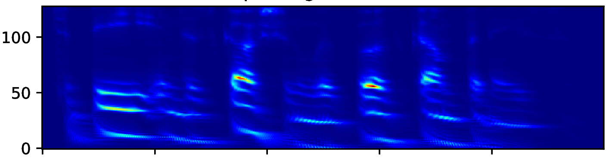
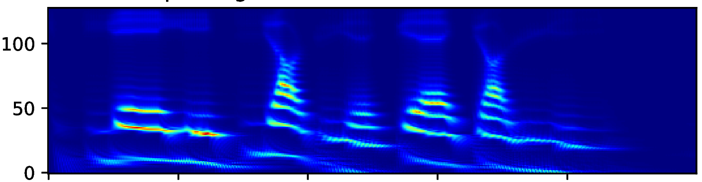
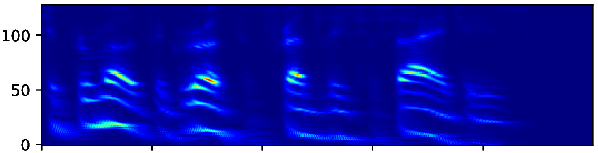
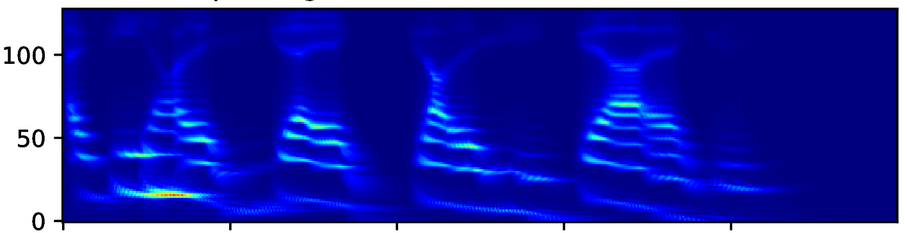
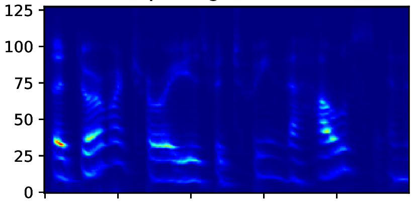
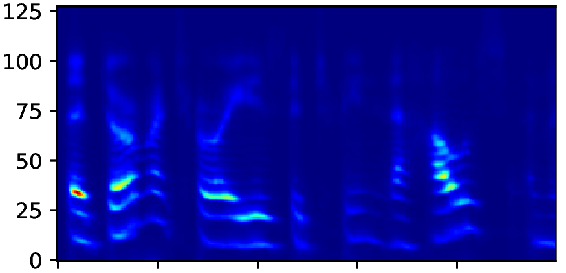
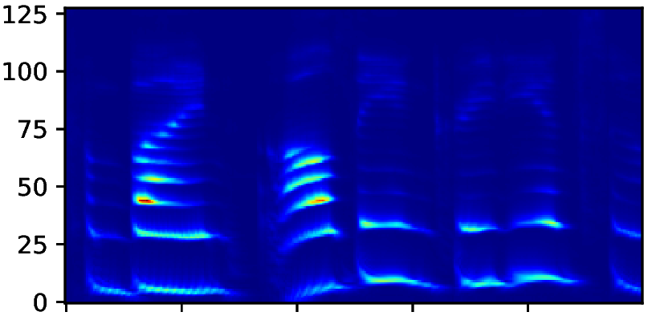
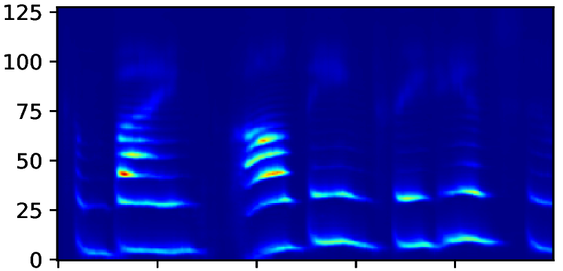

## MirrorNet : Sensorimotor Interaction Inspired Learning for Speech production

This website presents audio reconstructions and auditory spectrograms for experiments done with MirrorNet on speech production

### Brief Intro

Experiments to understand the sensorimotor neural interactions in the human cortical speech system support the existence of a bidirectional flow of interactions between the auditory and motor regions. Their key function is to enable the brain to ’learn’ how to control the vocal tract for speech production. This idea is the impetus for the recently proposed ”MirrorNet”, a constrained autoencoder architecture. 

### Audio Reconstructions and Auditory spectrograms

#### Learning control parameters for VOC synthesizer

    <table class="audioTable">
        <tr>
<!--             <th rowspan="2">Audio</th> -->
            <th colspan="2">Input Melody</th>
            <th colspan="2">VOC reconstructed Melody</th>
<!--             <th rowspan="2">Audio</th> -->
        </tr>
        <tr>
            <th width="200px">Audio</th>
<!--             <th>Parameters</th> -->
            <th width="500px">Auditory Spectrogram</th>
            <th width="500px">Auditory Spectrogram</th>
<!--             <th>Parameters</th> -->
            <th width="200px">Audio</th>
        </tr>
        <tr>
            <td><audio controls="controls"><source src="VOC_audio/wave_orig_1.mp3"></audio></td>
<!--             <td>PARAMS IMG</td> -->
            <td></td>
            <td></td>
<!--             <td>PARAMS IMG</td> -->
            <td><audio controls="controls"><source src="VOC_audio/VOC_1.mp3"></audio></td>
        </tr>
        <tr>
            <td><audio controls="controls"><source src="VOC_audio/wave_orig_9.mp3"></audio></td>
<!--             <td>PARAMS IMG</td> -->
            <td></td>
            <td></td>
<!--             <td>PARAMS IMG</td> -->
            <td><audio controls="controls"><source src="VOC_audio/VOC_9.mp3"></audio></td>
        </tr>
    </table>

#### Results with the articulatory speech synthesizer

    <table class="audioTable">
        <tr>
<!--             <th rowspan="2">Audio</th> -->
            <th colspan="2">Input Melody</th>
            <th colspan="2">Synthesized Melody</th>
<!--             <th rowspan="2">Audio</th> -->
        </tr>
        <tr>
            <th width="200px">Audio</th>
<!--             <th>Parameters</th> -->
            <th width="500px">Auditory Spectrogram</th>
            <th width="500px">Auditory Spectrogram</th>
<!--             <th>Parameters</th> -->
            <th width="200px">Audio</th>
        </tr>
        <tr>
            <td><audio controls="controls"><source src="TV_syn_audio/RealSpectrogram0.mp3"></audio></td>
<!--             <td>PARAMS IMG</td> -->
            <td></td>
            <td></td>
<!--             <td>PARAMS IMG</td> -->
            <td><audio controls="controls"><source src="TV_syn_audio/decoderSpectrogram0.mp3"></audio></td>
        </tr>
        <tr>
            <td><audio controls="controls"><source src="TV_syn_audio/RealSpectrogram7.mp3"></audio></td>
<!--             <td>PARAMS IMG</td> -->
            <td></td>
            <td></td>
<!--             <td>PARAMS IMG</td> -->
            <td><audio controls="controls"><source src="TV_syn_audio/decoderSpectrogram7.mp3"></audio></td>
        </tr>
    </table>

