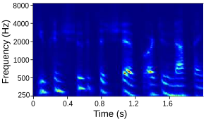
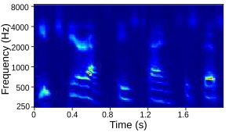

## Learning Articulatory Representations with the MIRRORNET

This website presents audio reconstructions and auditory spectrograms for experiments done with MirrorNet on speech production

### Brief Intro

Experiments to understand the sensorimotor neural interactions in the human cortical speech system support the existence of a bidirectional flow of interactions between the auditory and motor regions. Their key function is to enable the brain to ’learn’ how to control the vocal tract for speech production. This idea is the impetus for the recently proposed ”MirrorNet”, a constrained autoencoder architecture. 

### Audio Reconstructions and Auditory spectrograms

#### 1. Results with the articulatory speech synthesizer

Tables below show output auditory spectrograms and their corresponding acoustic output obtained by inverting the auditory spectrograms. The two input speech utterenaces are from a male speaker and a feamle speaker in the test split. 

    <table class="audioTable">
        <tr>
<!--             <th rowspan="2">Audio</th> -->
            <th>Description</th>
            <th>Audio</th>
	    	<th>Auditory spectrogram</th>
<!--             <th rowspan="2">Audio</th> -->
        </tr>
        <tr>
			<td> Input Audio (Female) 
            <td><audio controls="controls"><source src="TV_syn_audio/original/RealSpectrogram4.mp3"></audio></td>
<!--             <td>PARAMS IMG</td> -->
            <td></td>
        </tr>
        <tr>
			<td> Fully trained with source features 
            <td><audio controls="controls"><source src="TV_syn_audio/fully_trained/decoderSpectrogram4.mp3"></audio></td>
<!--             <td>PARAMS IMG</td> -->
            <td></td>
        </tr>
		        <tr>
			<td> Fully trained 'without' source features 
            <td><audio controls="controls"><source src="TV_syn_audio/6TV_syn/decoderSpectrogram4_6tvs.mp3"></audio></td>
<!--             <td>PARAMS IMG</td> -->
            <td></td>
        </tr>
		        <tr>
			<td> Lightly trained with source features 
            <td><audio controls="controls"><source src="TV_syn_audio/lightly_trained/decoderSpectrogram4_dev.mp3"></audio></td>
<!--             <td>PARAMS IMG</td> -->
            <td></td>
        </tr>
    </table>

    <table class="audioTable">
        <tr>
<!--             <th rowspan="2">Audio</th> -->
            <th>Description</th>
            <th>Audio</th>
	    	<th>Auditory spectrogram</th>
<!--             <th rowspan="2">Audio</th> -->
        </tr>
        <tr>
			<td> Input Audio (Male) 
            <td><audio controls="controls"><source src="TV_syn_audio/original/RealSpectrogram6.mp3"></audio></td>
<!--             <td>PARAMS IMG</td> -->
            <td></td>
        </tr>
        <tr>
			<td> Fully trained with source features 
            <td><audio controls="controls"><source src="TV_syn_audio/fully_trained/decoderSpectrogram6.mp3"></audio></td>
<!--             <td>PARAMS IMG</td> -->
            <td></td>
        </tr>
		        <tr>
			<td> Fully trained 'without' source features 
            <td><audio controls="controls"><source src="TV_syn_audio/6TV_syn/decoderSpectrogram6_6tvs.mp3"></audio></td>
<!--             <td>PARAMS IMG</td> -->
            <td></td>
        </tr>
		        <tr>
			<td> Lightly trained with source features 
            <td><audio controls="controls"><source src="TV_syn_audio/lightly_trained/decoderSpectrogram6.mp3"></audio></td>
<!--             <td>PARAMS IMG</td> -->
            <td></td>
        </tr>
    </table>

#### 2. Results with MirrorNet for SI task

Tables below show output auditory spectrograms and their corresponding acoustic output obtained by inverting the auditory spectrograms. Here the articulatory synthesizers developed in the previous step are used as the vocal tract model in the MirrorNet. 

    <table class="audioTable">
        <tr>
<!--             <th rowspan="2">Audio</th> -->
            <th>Description</th>
            <th>Audio</th>
	    	<th>Auditory spectrogram</th>
<!--             <th rowspan="2">Audio</th> -->
        </tr>
        <tr>
			<td> Input Audio 
            <td><audio controls="controls"><source src="MirrorNet_audio/original/wave2_orig.mp3"></audio></td>
<!--             <td>PARAMS IMG</td> -->
            <td></td>
        </tr>
        <tr>
			<td> With Initialization and Fully trained synthesizer 
            <td><audio controls="controls"><source src="MirrorNet_audio/fully_trained_init/VOCSpectrogram2_init.mp3"></audio></td>
<!--             <td>PARAMS IMG</td> -->
            <td></td>
        </tr>
		        <tr>
			<td> 'No' Initialization and Fully trained synthesizer 
            <td><audio controls="controls"><source src="MirrorNet_audio/fully_trained_noinit/VOCSpectrogram2_noinit.mp3"></audio></td>
<!--             <td>PARAMS IMG</td> -->
            <td></td>
        </tr>
		        <tr>
			<td> With Initialization and lightly trained synthesizer 
            <td><audio controls="controls"><source src="MirrorNet_audio/light_trained_init/VOCSpectrogram2_light.mp3"></audio></td>
<!--             <td>PARAMS IMG</td> -->
            <td></td>
        </tr>
    </table>

    <table class="audioTable">
        <tr>
<!--             <th rowspan="2">Audio</th> -->
            <th>Description</th>
            <th>Audio</th>
	    	<th>Auditory spectrogram</th>
<!--             <th rowspan="2">Audio</th> -->
        </tr>
        <tr>
			<td> Input Audio 
            <td><audio controls="controls"><source src="MirrorNet_audio/original/wave8_orig.mp3"></audio></td>
<!--             <td>PARAMS IMG</td> -->
            <td></td>
        </tr>
        <tr>
			<td> Fully trained with source features 
            <td><audio controls="controls"><source src="MirrorNet_audio/fully_trained_init/VOCSpectrogram8_init.mp3"></audio></td>
<!--             <td>PARAMS IMG</td> -->
            <td></td>
        </tr>
		        <tr>
			<td> Fully trained 'without' source features 
            <td><audio controls="controls"><source src="MirrorNet_audio/fully_trained_noinit/VOCSpectrogram8_noinit.mp3"></audio></td>
<!--             <td>PARAMS IMG</td> -->
            <td></td>
        </tr>
		        <tr>
			<td> Lightly trained with source features 
            <td><audio controls="controls"><source src="MirrorNet_audio/light_trained_init/VOCSpectrogram8_light.mp3"></audio></td>
<!--             <td>PARAMS IMG</td> -->
            <td></td>
        </tr>
    </table>

